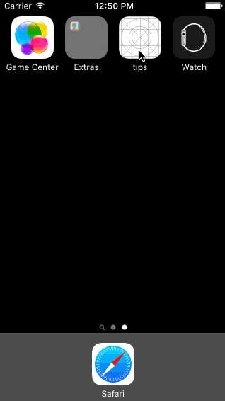

# Tip Calculator in Swift

This iOS app will calculate tip and total from a bill amount and one of three default tip percentages.

This tip calculator was built following CodePath's video tutorial ([Tip Calculator in Swift](https://vimeo.com/102084767)) as [prework](http://courses.codepath.com/snippets/ios_for_designers/thanks_for_applying#heading-prework) for the [iOS Bootcamp for Designers](http://codepath.com/iosfordesigners) class.

## Demo

## CodePath Answers
* This project took about **2 hours** actual working time to complete.
* All [required steps](http://courses.codepath.com/snippets/ios_for_designers/thanks_for_applying#heading-prework) are complete.
* No [optional steps](https://gist.github.com/timothy1ee/434cc97da182c490ea74#file-2-md) have been completed… yet!
